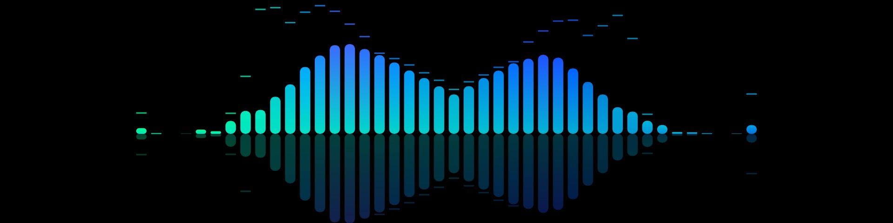
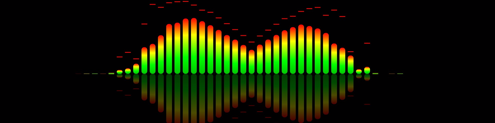
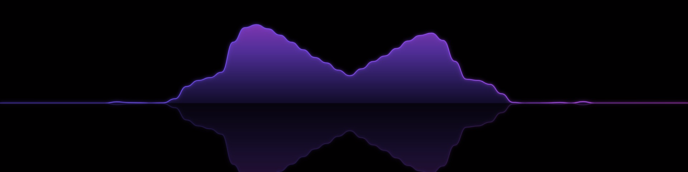
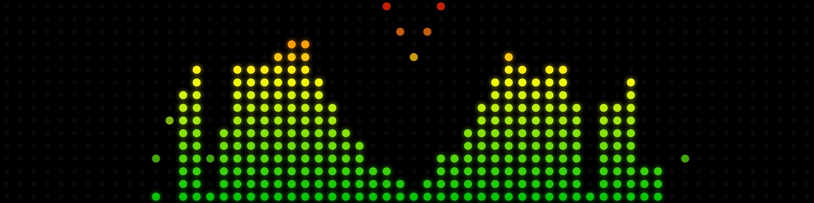

# Audio Spectrum Plugin for InfoPanel

A real-time audio spectrum visualizer plugin for [InfoPanel](https://github.com/habibrehmansg/infopanel). Captures your system audio output and renders a customizable spectrum visualization that you can display on your USB LCD panel or desktop overlay.

| Rounded + Neon + CenterOut | Classic + CenterOut + Reflection |
|:---:|:---:|
|  |  |

| Wave + Neon + Reflection | Wave + Fire | Dots + Classic + CenterOut |
|:---:|:---:|:---:|
|  |  |  |

## How It Works

The plugin captures your PC's audio output (whatever you hear through your speakers/headphones) using Windows WASAPI loopback, runs it through a 4096-point FFT to extract frequency data, and renders a spectrum visualization as a JPEG image stream. InfoPanel picks up the stream via a local HTTP URL and displays it as a live image on your panel.

**Data flow:**

```
System Audio -> WASAPI Loopback -> FFT Analysis -> Spectrum Rendering -> HTTP Server -> InfoPanel
```

The plugin also exposes per-band frequency sensors, peak level, and average level values that you can use in InfoPanel's sensor display items, gauges, or graphs.

## Installation

### Pre-built (recommended)

1. Download the latest release from the [Releases](https://github.com/emaspa/infopanel-audio-spectrum/releases) page
2. Extract the `InfoPanel.AudioSpectrum` folder into your InfoPanel plugins directory:
   ```
   C:\ProgramData\InfoPanel\plugins\InfoPanel.AudioSpectrum\
   ```
3. Start (or restart) InfoPanel
4. Go to the **Plugins** page and enable **Audio Spectrum**

### From source

See [Building from Source](#building-from-source) below.

## Usage

Once the plugin is running, it exposes:

- **Spectrum Image** - A text sensor containing the MJPEG stream URL (e.g. `http://localhost:52400/spectrum.avi`)
- **Per-band frequency sensors** - Individual values for each frequency band (e.g. "63Hz", "250Hz", "4.0kHz")
- **Peak Level** / **Average Level** - Overall spectrum intensity as percentages
- **Audio Input Level** - Raw audio amplitude from the capture device
- **Audio Device** - Name of the currently captured audio device

### Adding the spectrum to your panel

1. In your InfoPanel profile, add an **Image** display item
2. Set the source to **Http Image**
3. For the URL, use the value from the **Spectrum Image** sensor (shown in the Plugins page), typically:
   ```
   http://localhost:52400/spectrum.avi
   ```
4. Resize and position the image on your panel layout

### Using frequency sensors

The per-band sensors (e.g. "63Hz", "1.0kHz") can be used anywhere InfoPanel accepts sensor values: text display items, bar graphs, gauges, charts, etc. This lets you build custom visualizations beyond the built-in spectrum image.

## Configuration

All settings are stored in an INI file located next to the plugin DLL:

```
C:\ProgramData\InfoPanel\plugins\InfoPanel.AudioSpectrum\InfoPanel.AudioSpectrum.dll.ini
```

The config file is auto-generated with defaults on first run. Most settings can be changed live from the Plugins page in InfoPanel without restarting. You can also edit the INI file directly with a text editor (restart the plugin to apply).

### Example config

```ini
[AudioSpectrum]
AudioDevice =
BandCount = 32
ImageWidth = 400
ImageHeight = 150
Style = Bars
ColorScheme = Neon
CustomColor1 = #00FF80
CustomColor2 = #0080FF
BackgroundColor = #FF000000
BarSpacing = 0.3
CornerRadius = 4
ShowPeaks = true
ShowReflection = false
Brightness = 1.0
Smoothing = 0.3
PeakDecay = 0.02
Alignment = Left
ContentWidth = 1.0
CenterOut = false
Gain = 1.5
EdgeBoost = 5
ServerPort = 52400
FollowWaveLink = false
```

### Settings Reference

#### Audio

| Setting | Default | Range | Description |
|---------|---------|-------|-------------|
| `AudioDevice` | *(empty)* | - | Audio device to capture. Leave empty for default output device, or set to a partial device name (e.g. `Speakers`, `Realtek`). Available devices are listed as comments in the config file. |
| `FollowWaveLink` | `false` | `true` / `false` | Capture all Elgato Wave Link virtual audio channels simultaneously and mix them to recreate the full audio mix for spectrum visualization. Requires Wave Link 3.x running on the same machine. Overrides `AudioDevice` when active. See [Wave Link Integration](#elgato-wave-link-integration). |

#### Image Output

| Setting | Default | Range | Description |
|---------|---------|-------|-------------|
| `ImageWidth` | `400` | 100 - 3840 | Width of the rendered spectrum image in pixels. |
| `ImageHeight` | `150` | 50 - 2160 | Height of the rendered spectrum image in pixels. |
| `BackgroundColor` | `#FF000000` | Hex color | Background color. Use `Transparent` for no background, or an ARGB hex value like `#FF000000` (opaque black). |

#### Spectrum Analysis

| Setting | Default | Range | Description |
|---------|---------|-------|-------------|
| `BandCount` | `32` | 8 - 128 | Number of frequency bands. More bands = finer frequency resolution but thinner bars. |
| `Gain` | `1.5` | 0.5 - 5.0 | Multiplier applied to band values after FFT. Higher values make bars taller / more reactive. |
| `Smoothing` | `0.3` | 0.05 - 0.95 | How much the bars smooth between frames. Lower = snappier response, higher = smoother motion. |
| `PeakDecay` | `0.02` | 0.005 - 0.1 | How fast peak indicators fall after reaching their highest point. Lower = slower decay. |

#### Visual Style

| Setting | Default | Values | Description |
|---------|---------|--------|-------------|
| `Style` | `Bars` | `Bars`, `Rounded`, `Wave`, `Dots`, `Mirror` | Rendering style (see [Styles](#styles) below). |
| `ColorScheme` | `Neon` | `Neon`, `Fire`, `Ice`, `Rainbow`, `Ocean`, `Monochrome`, `Classic`, `Custom` | Color scheme (see [Color Schemes](#color-schemes) below). |
| `BarSpacing` | `0.3` | 0.0 - 0.8 | Gap between bars as a fraction of bar width. `0` = no gap, `0.5` = gap equal to bar width. |
| `CornerRadius` | `4` | 0 - 20 | Corner rounding in pixels. Mainly affects the `Rounded` style. |
| `ShowPeaks` | `true` | `true` / `false` | Show peak hold indicators that float above the bars and slowly decay. |
| `ShowReflection` | `false` | `true` / `false` | Show a faded mirror reflection below the spectrum. |
| `Brightness` | `1.0` | 0.1 - 2.0 | Overall brightness multiplier. Values above 1.0 make colors more vivid. |

#### Layout

| Setting | Default | Range | Description |
|---------|---------|-------|-------------|
| `Alignment` | `Left` | `Left`, `Center`, `Right` | Horizontal alignment of the spectrum within the image. |
| `ContentWidth` | `1.0` | 0.1 - 1.0 | Fraction of the image width used by the spectrum. `0.5` = spectrum uses half the width. |
| `CenterOut` | `false` | `true` / `false` | Reorder bands so low frequencies are in the center and high frequencies are on the edges. Creates a symmetrical look. |
| `EdgeBoost` | `5` | 1 - 15 | Multiplier for edge bands when CenterOut is enabled. High frequencies naturally have less energy; this compensates so edge bars are visible. Only applies when `CenterOut = true`. |

#### Custom Colors

| Setting | Default | Format | Description |
|---------|---------|--------|-------------|
| `CustomColor1` | `#00FF80` | Hex color | Start color for the `Custom` color scheme gradient. |
| `CustomColor2` | `#0080FF` | Hex color | End color for the `Custom` color scheme gradient. |

#### Server

| Setting | Default | Range | Description |
|---------|---------|-------|-------------|
| `ServerPort` | `52400` | 1024 - 65535 | HTTP server port. If the port is busy, the plugin tries the next two ports, then falls back to a random port. |

### Styles

- **Bars** - Classic vertical bars with gradient coloring. Clean and readable.
- **Rounded** - Same as Bars but with rounded corners on each bar. Uses the `CornerRadius` setting.
- **Wave** - Smooth curve connecting the frequency bands with a glow effect and filled area beneath.
- **Dots** - Matrix-style dot display with 16 dots per column. Active dots glow, inactive dots are dimmed.
- **Mirror** - Bars extend both up and down from a center line, creating a symmetrical waveform effect.

### Color Schemes

- **Neon** - Cyan/green to magenta. Vibrant and modern.
- **Fire** - Orange to yellow. Warm and intense.
- **Ice** - Light blue to white. Cool and clean.
- **Rainbow** - Full spectrum HSL cycling across the frequency range.
- **Ocean** - Deep blue to cyan/turquoise. Subtle and calm.
- **Monochrome** - Grayscale gradient.
- **Classic** - Per-bar green-yellow-red gradient based on intensity (like a VU meter).
- **Custom** - Linear gradient between `CustomColor1` and `CustomColor2`.

## Elgato Wave Link Integration

If you use [Elgato Wave Link](https://www.elgato.com/wave-link) to manage your audio, enable the `FollowWaveLink` option to have the plugin automatically capture all Wave Link virtual channels (System, Music, Browser, Game, etc.) and mix them together. This recreates your full audio mix for spectrum visualization regardless of which physical output device you have selected in Wave Link.

**How it works:**

1. The plugin connects to Wave Link's local WebSocket API and discovers all configured audio channels
2. It opens a WASAPI loopback capture on each channel's virtual audio device simultaneously
3. The audio from all channels is mixed together in real time for FFT analysis and spectrum rendering
4. When the output device changes in Wave Link (e.g. switching from speakers to headphones), the display updates automatically

**Requirements:**

- Wave Link 3.x running on the same machine
- The setting can be toggled on/off live from the Plugins page in InfoPanel (no restart needed)
- When active, the Audio Device sensor shows "Wave Link Mix (device name)" where device name is the currently selected output

## Building from Source

### Prerequisites

- [.NET 8.0 SDK](https://dotnet.microsoft.com/download/dotnet/8.0) (x64)
- Windows 10/11

### Build

Clone the repository and build:

```bash
git clone https://github.com/emaspa/infopanel-audio-spectrum.git
cd infopanel-audio-spectrum
```

If you have the InfoPanel source code alongside this project:

```bash
dotnet publish -c Release -r win-x64 --self-contained false
```

If your InfoPanel source is in a different location, pass the path to the Plugins project:

```bash
dotnet publish -c Release -r win-x64 --self-contained false \
  -p:InfoPanelPluginsPath=/path/to/infopanel/InfoPanel.Plugins/InfoPanel.Plugins.csproj
```

The output will be in `bin/Release/net8.0-windows/win-x64/publish/`.

### Deploy

Copy the contents of the publish folder to your InfoPanel plugins directory:

```
C:\ProgramData\InfoPanel\plugins\InfoPanel.AudioSpectrum\
```

If you already have a config file (`InfoPanel.AudioSpectrum.dll.ini`) in that folder, copying just the DLL files will preserve your settings.

## Writing Your Own InfoPanel Plugin

This plugin can serve as a reference for building InfoPanel plugins. Here's the basic structure:

### 1. Create a .NET 8.0 class library

```xml
<Project Sdk="Microsoft.NET.Sdk">
  <PropertyGroup>
    <TargetFramework>net8.0-windows</TargetFramework>
    <EnableDynamicLoading>true</EnableDynamicLoading>
    <RuntimeIdentifier>win-x64</RuntimeIdentifier>
  </PropertyGroup>

  <ItemGroup>
    <ProjectReference Include="..\InfoPanel.Plugins\InfoPanel.Plugins.csproj">
      <Private>false</Private>
      <ExcludeAssets>runtime</ExcludeAssets>
    </ProjectReference>
  </ItemGroup>

  <ItemGroup>
    <None Update="PluginInfo.ini">
      <CopyToOutputDirectory>Always</CopyToOutputDirectory>
    </None>
  </ItemGroup>
</Project>
```

Key points:
- `EnableDynamicLoading` must be `true` so the plugin loads in an isolated context
- The `InfoPanel.Plugins` reference must have `Private=false` and `ExcludeAssets=runtime` so the DLL isn't duplicated
- The folder name, DLL name, and `.csproj` name must all match (e.g. `InfoPanel.MyPlugin`)

### 2. Add a PluginInfo.ini manifest

```ini
[PluginInfo]
Name=My Plugin
Description=What the plugin does
Author=Your Name
Version=1.0.0
Website=https://github.com/you/your-plugin
```

### 3. Implement the plugin class

```csharp
using InfoPanel.Plugins;

public class MyPlugin : BasePlugin
{
    private readonly List<PluginContainer> _containers = [];

    public MyPlugin() : base("my-plugin", "My Plugin", "Description of my plugin") { }

    public override TimeSpan UpdateInterval => TimeSpan.FromSeconds(1);

    public override void Initialize()
    {
        var container = new PluginContainer("Main");

        // Add sensors (numeric values with units)
        var sensor = new PluginSensor("my-sensor", "CPU Temp", 0, "C");
        container.Entries.Add(sensor);

        // Add text values
        var text = new PluginText("my-text", "Status", "OK");
        container.Entries.Add(text);

        _containers.Add(container);
    }

    public override void Update()
    {
        // Update sensor values here on each tick
    }

    public override void Load(List<IPluginContainer> containers)
    {
        containers.AddRange(_containers);
    }

    public override void Close()
    {
        // Cleanup resources
    }
}
```

### 4. Build and deploy

```bash
dotnet publish -c Release -r win-x64 --self-contained false
```

Copy the publish output to `C:\ProgramData\InfoPanel\plugins\InfoPanel.MyPlugin\`.

For more details, see the [InfoPanel plugin documentation](https://github.com/habibrehmansg/infopanel/blob/master/PLUGINS.md).

## Technical Details

- **Audio capture**: WASAPI loopback via raw COM P/Invoke (no NAudio device capture, works in any .NET AssemblyLoadContext)
- **FFT**: 4096-point FFT with Hann windowing via NAudio.Dsp
- **Frequency mapping**: Logarithmic band spacing from 20 Hz to 20 kHz
- **Rendering**: SkiaSharp (Skia) for all drawing, JPEG output at quality 90
- **Streaming**: Minimal AVI/MJPEG HTTP server for real-time frame delivery
- **Update rate**: ~10 FPS (100ms interval)

## Support

If you find this plugin useful, consider supporting the project:

[](https://buymeacoffee.com/emaspa)

## License

MIT
